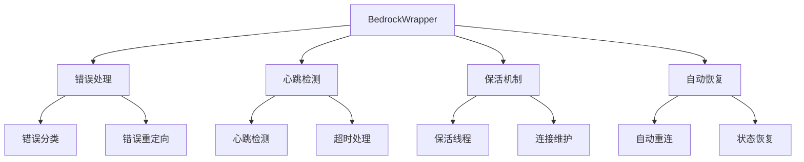
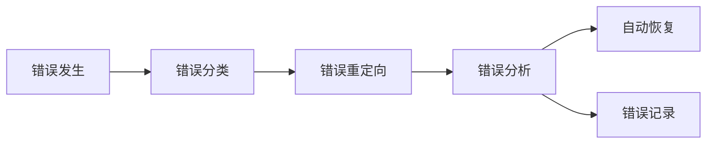
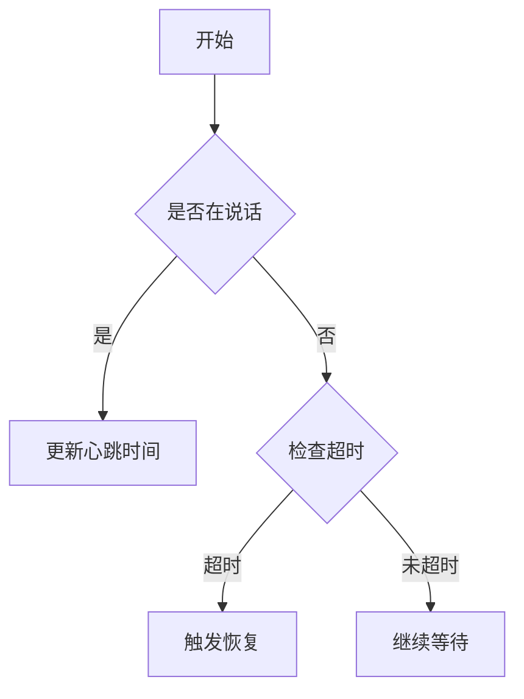
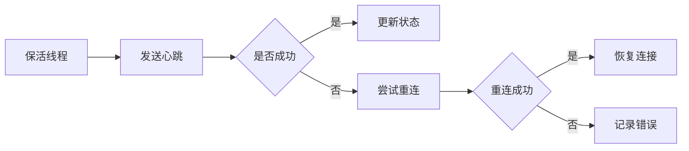

# BedrockWrapper 模块文档

## 1. 模块概述

BedrockWrapper 是一个用于与 Amazon Bedrock 服务交互的 Python 封装模块，提供了完整的错误处理、心跳检测和自动恢复机制。



## 2. 核心特性

### 2.1 错误处理机制



- **错误分类**：支持 7 种错误类型
  - 连接超时
  - 读取超时
  - 验证错误
  - 流处理错误
  - 保活错误
  - 重连错误
  - 未知错误

- **错误重定向**：所有错误信息输出到 stderr
- **错误分析**：使用正则表达式匹配错误模式
- **错误记录**：记录最后一次错误类型

### 2.2 心跳检测机制



- **心跳间隔**：5 秒
- **最大静默时间**：10 秒
- **超时处理**：自动触发恢复机制

### 2.3 保活机制



- **保活间隔**：60 秒
- **心跳请求**：轻量级 API 调用
- **自动恢复**：连接失败时自动重试

## 3. 使用示例

### 3.1 基本使用

```python
# 初始化
wrapper = BedrockWrapper()

# 调用模型
response = wrapper.invoke_bedrock(
    text="你好",
    dialogue_list=history,
    images=[]
)

# 检查错误
if wrapper.get_last_error():
    print(f"发生错误: {wrapper.get_last_error()}")
    wrapper.clear_last_error()
```

### 3.2 错误处理

```python
try:
    response = wrapper.invoke_bedrock(...)
except Exception as e:
    error_type = wrapper.get_last_error()
    if error_type == ErrorType.CONNECTION_TIMEOUT:
        # 处理连接超时
        pass
    elif error_type == ErrorType.READ_TIMEOUT:
        # 处理读取超时
        pass
```

## 4. 配置参数

| 参数               | 默认值 | 说明         |
| ------------------ | ------ | ------------ |
| connect_timeout    | 5s     | 连接超时时间 |
| read_timeout       | 30s    | 读取超时时间 |
| heartbeat_interval | 5s     | 心跳检测间隔 |
| max_silence_time   | 10s    | 最大静默时间 |
| keepalive_interval | 60s    | 保活心跳间隔 |

## 5. 最佳实践

1. **错误处理**
   - 定期检查 `get_last_error()`
   - 及时清除错误状态 `clear_last_error()`
   - 根据错误类型采取相应措施

2. **性能优化**
   - 根据网络状况调整超时时间
   - 合理设置保活间隔
   - 监控错误频率

3. **资源管理**
   - 使用 `with` 语句确保资源释放
   - 及时停止保活线程
   - 清理错误状态

## 6. 注意事项

1. 确保 AWS 凭证正确配置
2. 监控 stderr 输出以捕获错误
3. 定期检查连接状态
4. 根据实际需求调整超时参数